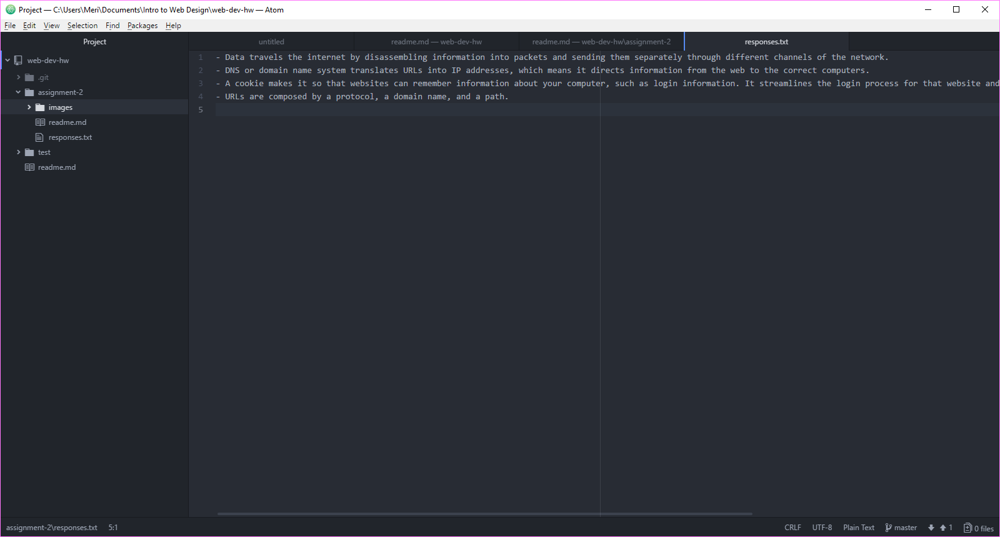

## Assignment 2

Version Control Systems allow developers to make changes to a file and then track the changes made. This can be helpful to go back and see what has been done to a file. It also allows developers to go back to a previous version of the file if a change made does not work for the project. Version control is also good for collaborative work. All developers working on the file can go back through the timeline of changes and see what has been done to it. In this class it will help me track my work and learn from mistakes. It also backs up my work consistently.

[My assignment 2 responses](./responses.txt)

In this assignment:
- I followed the directions provided to produce this assignment. I tried not to stray from those directions in order to reinforce what the topic taught.
- Once I actually got to the assignment on my own there were small things I couldn't remember how to do right off the top of my head. I went back to the class website to review the topic.
- At this point I feel like I need to practice the basics so that I can work with the programs better in the future.
- I did not post any issues to the repo or help any classmates, more due to lack of time in my schedule. It will come in handy later on, most likely.

