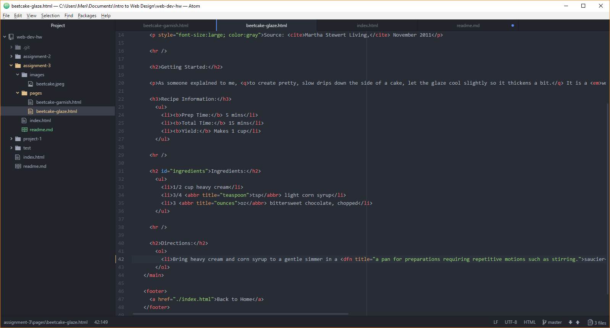

# Readme.md

There are a number of different elements which may be included in the head and the body. The head, which is where important information about the page itself is, can tell a browser about character set, a page description, author, page dimensions, title, resources, and style. The body-where the data processed by the browser is-contains stylistic formatting like headings, paragraphs, breaks, lists, links, and font changes.

In the body there are two different forms of markup. Structural markup translates the format choices you might make for your page (i.e. headings, subheadings, paragraphs, breaks, lists).Semantic markup allows you to reinforce the information on the document. With semantic markup you can bold, underline, italicize or strikethrough your words. You can also emphasize, strong, and insert and delete. It also formats information like addresses, links, quotes, citations, abbreviations, and definitions.

Assignment 3:
- I worked on following directions and formatting semantic and structural markup correctly, as well as understand the functions of head elements.
- I doubted myself during this assignment a lot on whether or not I had linked everything properly, particularly during the definitions section of the document.
- I feel like I need to keep looking at head elements and their various purposes as well as fully understand linking within documents.
- I did not post any issues or help classmates this assignment.

