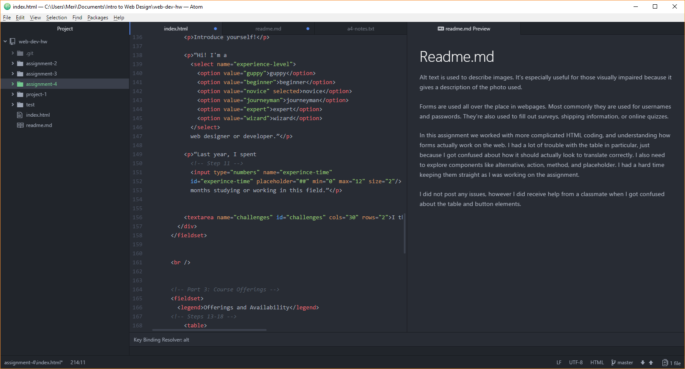

# Readme.md

Alt text is used to describe images. It's especially useful for those visually impaired because it gives a description of the photo used.

Forms are used all over the place in webpages. Most commonly they are used for usernames and passwords. They're also used to fill out surveys, shipping information, or online quizzes.

In this assignment we worked with more complicated HTML coding, and understanding how forms actually work on the web. I had a lot of trouble with the table in particular, just because I got confused about how it should actually look to translate correctly. I also need to explore components like alternative, action, method, and placeholder. I had a hard time keeping them straight as I was working on the assignment.

I did not post any issues, however I did receive help from a classmate when I got confused about the table and button elements.

