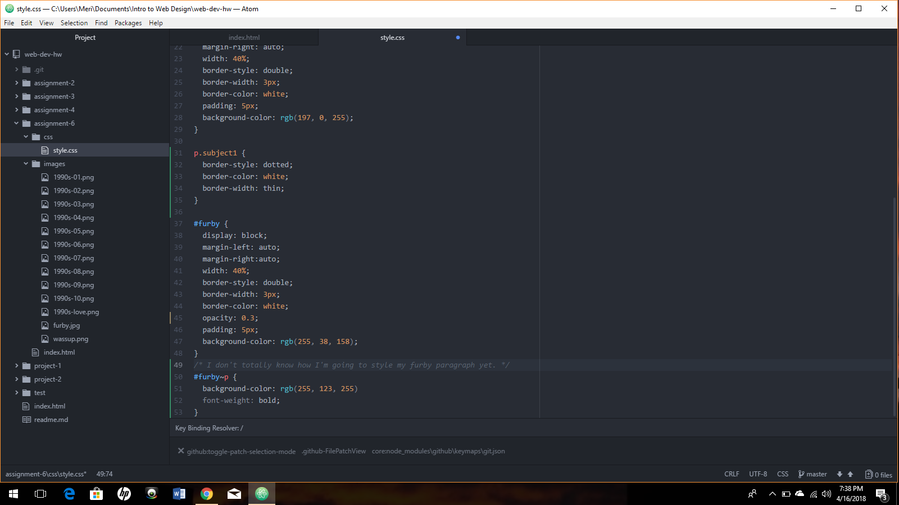

# Readme.md

I chose the geometric shape from the 1990's folder. I chose this time period and this shape because it reminds me of my sister's middle school school photos and it evoked the most nostalgia for me, personally. I chose fairly bright, kind of clashing colors to go with the graphic.

The three colors I chose were white, RGB (255, 123, 255), (70, 23, 180), (197, 0, 255), and (255, 38, 158). They're all blues, purples, and pinks to go with the white.

For this project I paid close attention to selectors and chaining, I found those to be most difficult, but mostly because I had a hard time keeping them straight and understanding their different functions. A lot of what I did to work through this was to closely follow the website examples and try these out via trial and error. I really enjoy CSS, I'm really interested in the design aspect of coding more than anything else, so I was anxious to get to this point. I did not post to the repo or help anyone else out with this assignment.

