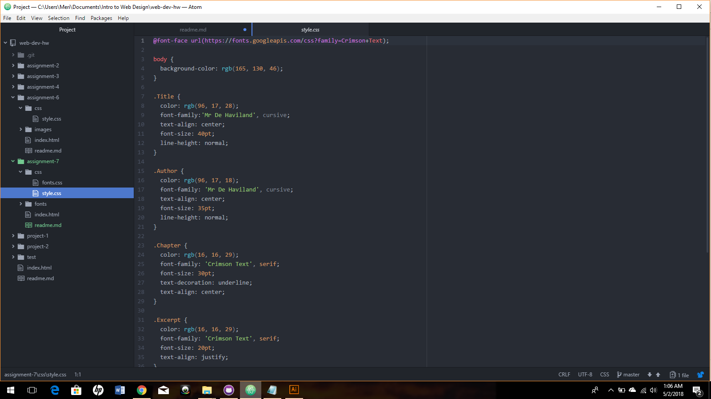

# Readme.md

For this assignment, I chose two fonts. I chose a serif font called "Crimson Text" that looked similar to the actual font used as the body copy in the Harry Potter series (They used Adobe Garamond), and then I used a handwriting font called Mr. De Haviland that reminded me of Professor McGonagall's "handwriting" which occurs throughout the series. Then I chose three colors, an ochre gold color, a dark scarlett, and deep blue. They're all colors I associate with the books, which were an integral part of my childhood.

A system font relies on the type of computer you're operating on, whether it's Mac or PC. These will show up on your device, but probably won't show up on the opposing device. Web fonts are custom fonts hosted on a server. They're fairly common, but can have some setbacks in terms of their performance. Web-safe fonts are pretty much guaranteed to show up regardless of device, because they're available on all systems.

Should your chosen font fail to load, it's encouraged that you provide a list of back up fonts separated by commas. If your first font fails, the fonts included as fallbacks will load instead. They are not to be chosen on a whim, because they can affect the overall design of your page.

I really liked this assignment, I'm much more interested in how CSS works than other languages, just because I'm interested in design. I particularly had trouble figuring out fonts, and I know for a fact the handwriting one I chose isn't coming through. However, it's one in the morning and I have an exam tomorrow, so it's going to have to stay how it is. I wouldn't mind going over embedding fonts and font-face rules to clarify exactly how the process should go, since that was what I had the most trouble with in this assignment. I did not post any issues or help any classmates, for lack of time during this part of the semester.

