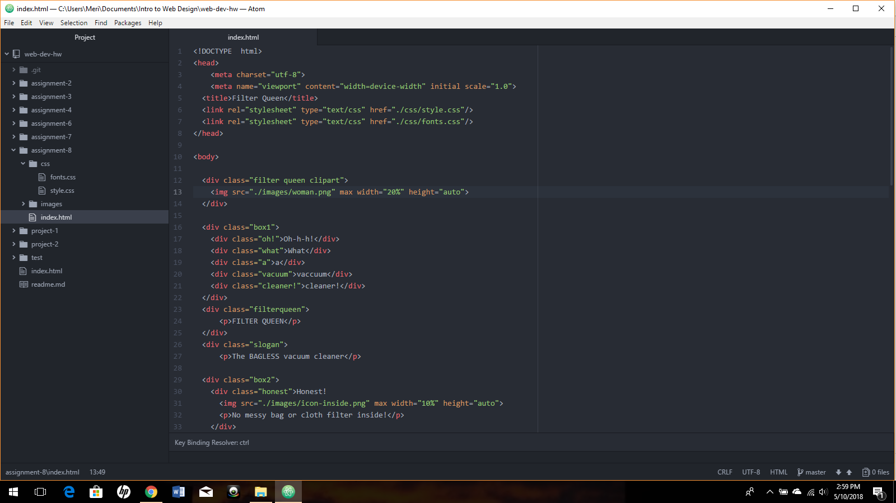

# Readme.md

A border is the line of the box which contains the material inside it. Borders can be styled or plain. Padding is the amount of room between the text and border from all sides, while margins is the amount of room in which the text is confined.

I didn't see the email about this assignment until this morning, so I will admit I did not spend nearly as much time on it as I should have. Especially with finals, I have been a total wreck. So the hardest part for me on this assignment was rushing to turn it in rather than the actual coding itself. It's definitely not my best work.

Because I rushed through this assignment, I know that none of my elements actually turned out the way I would really have liked them to. I need to sit down and really go through the layout information to actually understand it well enough to create something I would actually be proud of. Again, for lack of time this week, I didn't post to the issues board at all.

