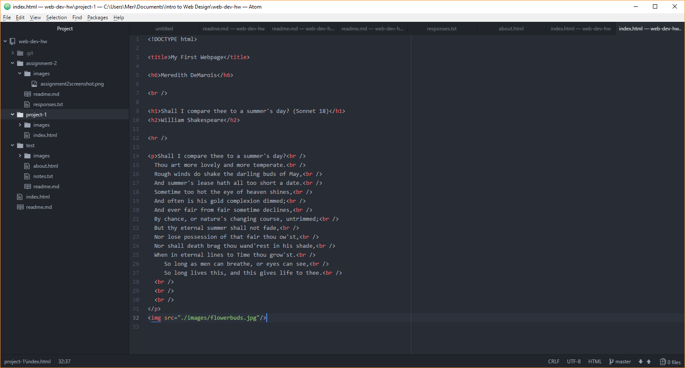

## Project 1

I primarily used Chrome as my web browser, both on my computer and my phone (because it's a Google Pixel). Web browsers like Chrome translate CSS, HTML, and JavaScript code into the content you see on the web, across several different types of platforms from copy to photos and videos.

I found the Wayback Machine to be so interesting. It's easy to forget how far the internet has come even from ten years ago. I visited Nike's website from Feb. 29, 2000. It was pretty simple, and definitely evoked Nike's late 90's feel. If you look at their website now it's so interactive and well-developed that it's hard to believe they had it any other way.

In this assignment:
- I paid particular attention to using HTML code correctly. I played with line breaks a couple different ways until I made sure it made sense in terms of layout, and followed the original pattern of Shakespeare's 18th Sonnet in the body of the content. I also wanted to make sure I had my webpage laid out correctly.
- I had a little trouble getting the line breaks down. I think practicing them more and using them more over time will resolve this, and make it easier to do them without thinking about it.
- I'm interested in seeing how complex webpages can become between linking and developing.
- I did not post any issues, nor ask classmates for help with this homework.

